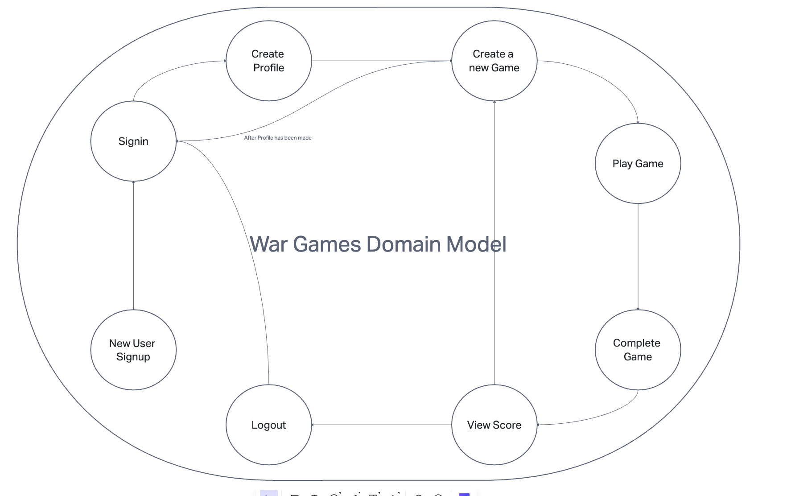
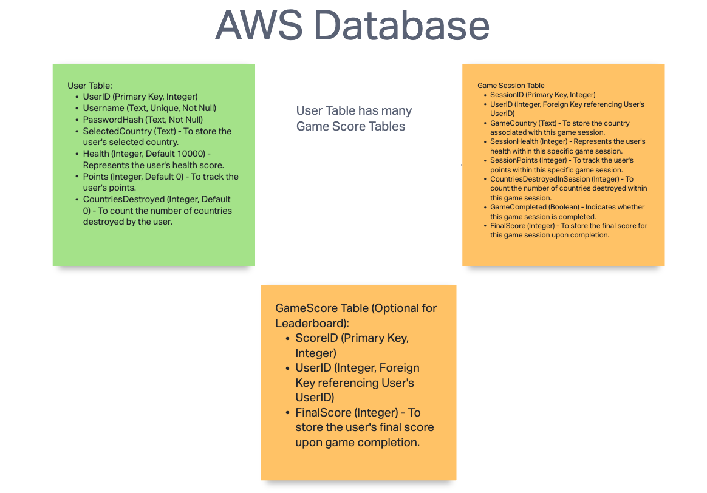

# Software requirements

## User Stories

[User Stories](https://trello.com/b/nFtx4BBn/techtrailblazers)

## Vision

> The Game of War is based on the movie War Games where different countries send off attacks and then a response is then generated from the defending country, This will utilize the CAPS systems to send automatically generated responses whenever a country is being attacked. This game could include as many countries as we want and the responses can auto generate so that it will be different every time.

## Scope

### Scope in

This product features are the following:

- A user will be able to create an account by providing a username and password.
- A user will be able to log in to their account using their username and password.
- A user will be able to view their profile page.
- A score will be displayed on the profile page.
- A user will be able to input a country name and then the country will be able to send an attack to another country.
- The other country will then be able to send a response back to the attacking country.
- The response will be generated from the CAPS system.
- The response will be sent to the attacking country.
- The attacking country will then be able to send another attack to the defending country.
- The defending country will then be able to send another response back to the attacking country.

### Scope out

This product will not be develop in mobile applications or desktop applications.

## Functional

Our MVP functionality would be to have a working response system that will send a response anytime a certain event will be triggered. It will also have a user input a country name and then the country will be able to send an attack to another country. The other country will then be able to send a response back to the attacking country. The response will be generated from the CAPS system.

### Stretch

Our stretch goals are you going to aim for multiply player functionality and a more complex response system. We will also try to implement a more complex attack system that will be able to send multiple attacks at once.

### Data Flow

The flow of this application is a user will be able to create an account by providing a username and password. A user will be able to log in to their account using their username and password. A user will be able to view their profile page. A score will be displayed on the profile page. A user will be able to input a country name and then the country will be able to send an attack to another country. The other country will then be able to send a response back to the attacking country. The response will be generated from the CAPS system. The response will be sent to the attacking country. The attacking country will then be able to send another attack to the defending country. The defending country will then be able to send another response back to the attacking country. The point system will be based on how many attacks you send and how many responses you get back. In the end the country with the most points will win.

## Non-Functional

### Security

It is important that the user's information is secure. We will be using bcrypt to hash the user's password. We will also be using JWT to authenticate the user. NoSQL injection will also be used to prevent any malicious attacks.

### Usability

It is important that the user is able to use the application with ease. We will be using from the command line. that will be easy to navigate. We will also be using a simple login system that will be easy to use.

## Domain Modeling

## Schema Diagram

- The User table stores user information, including their unique UserID, Username for identification, securely hashed PasswordHash, and a Score representing the user's game score. Users can have multiple game scores.

The GameScore table (optional) can be used to store final scores achieved by users upon game completion if you decide to implement a leader board feature.

- The UserGameState table is introduced to manage the user's game progress within the ongoing game. It includes fields like CurrentCountry, CurrentHealth, CurrentPoints, CountriesDestroyedInGame, and GameCompleted to track the game state.

## Game play Rules

- once user has created a profile they will select what country they would like to play as.

- then when they play the game it will be a text based situation, a series of questions regarding there move to attack another country.

- once they have selected their answer and auto generated response will occur replying to there selected choice.

- The player will start off with a health score of 10000 and point will be deducted when they are hit from another country

- points will be added by successful attack and then health will be deducted when another country is successful in retaliation.

- There will be three different attack options, each will have a higher hit score but the higher the hit score the less probable of successful attack.

<!-- - There will be a fourth option of defense where they will skip a turn but negate any damage that may come there way. -->

- A completion of game will occur when users country has been destroyed or user has successfully destroyed attacking country.

<!-- - once game is complete the results will be stored on user profile (stretch will be a board where highest scores are displayed) -->
